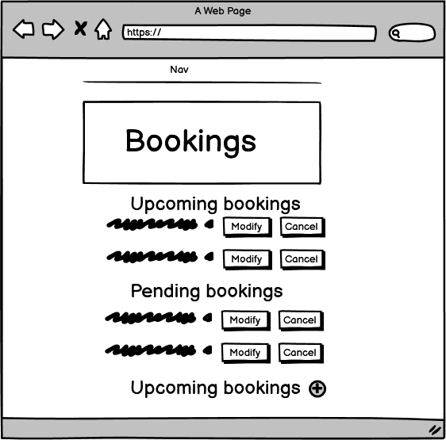
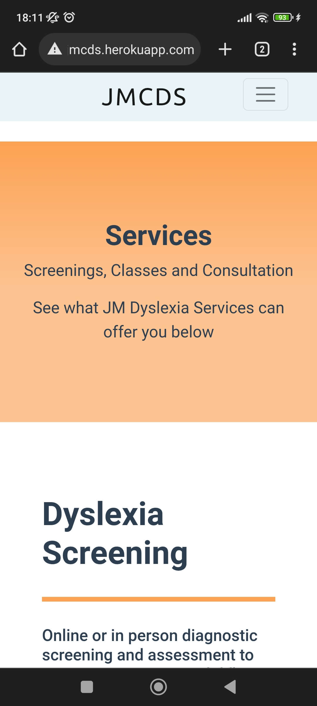

# Jennie MacAleese Dyslexia Service


[Link to live Site](https://jmcds.herokuapp.com/)

JMCDS is a Full Stack site with a centrally owned dataset, user authentication and role-based access to mechanisms within the site. It was built for my fourth Portfolio project with [Code Institute](https://codeinstitute.net/ie/) and exists purely for the purpose of displaying my knowledge & capabilities in regard to the project's assessment criteria.

JMCDS is a prototype site to demonstrate what could potentially be used as a site for my sister Jennie MacAleese to offer in the future to potential clients, upon qualification as a Specialist Dyslexia Practitioner. The site advertises the services she may offer and manage bookings. It will also allow users to communicate with her, register with her site and book classes.

## Agile Methodology:
  - An agile approach to development was taken on this project.
  - Development was done with an iterative approach, whereby small workable additions and changes were made over the course of the project.
  - User stories were followed when putting together features for this site. A project Kanban board and Github issues, were used to asist throughout the build process.
  
  - This approach allowed changes to be made during the build with minimal disruption to other components of the site. For instance, the home and booking apps were separate entities to the blog app. The blog app is a feature which could have been implemented but for what the site owner envisaged, it was deemed unnecessary and could be removed without affecting the rest of the site.
  - I also received feedback from the potential site owner through the build process and manually tested components as they were implemented.
## User Experience:

 * ## Vision:
  The idea and aim of the site is to create a clear and obvious representation of what the business offers to its clients. The site should provide information on the services on offer and give users the ability to get in contact with Jennie to avail of the services or send any queries they may have.
  The site should also provide a portal for clients to register, provide their information and submit booking requests for classes at their own convenience, supplying both user and site owner a simple way to manage class scheduling.
  For the site owner, the ability to manage the teaching schedule and handle client bookings through the admin site is necessary for the efficient running of the business. The site has a fully functioning CRUD functionality for both the site admin and users.
 * ## Target Audience:
  Dyslexia affects up to [20% of us](https://dyslexia.yale.edu/dyslexia/dyslexia-faq/). It is one of the most common learning difficulties encountered in society. The target audience for this site would be dyslexia sufferers, those who may think an assessment is worth their time and those who care for dyslexia sufferers or who know someone they believe may benefit from the service. 
  The services provided can help those with dyslexia cope with any associated struggles of the condition in their day-to-day lives, in education, work or at home, and it is those that the site aims to connect with and offer assistance to.
  
  * ## User stories:
  As a site owner:
  1. As a site owner I can advertise my services so that potential clients can learn about my business
  2. As a site owner I can receive contact from users so that I can respond to any queries or requests
  3. As a site owner I can access client bookings so that I can modify or delete if necessary
  4. As a site owner I can accept, cancel and modify bookings so that I can manage my calendar efficiently
  
  As a user:
  1. As a site user I can register an account so that I provide my information & book classes
  2. As a site user I can easily navigate the site so that I can find all the necessary information and features without difficulty
  
  As a returning user:
  1. As a registered user I can access my bookings so that I can modify them and delete them if necessary
  2. As a registered user I can view my previous bookings so that I can see the history of classes I have taken  
 
 * ## UX Plane:
1. ### Strategy:
  - Build a site for JM Dyslexia Services which clearly advertises the services on offer.
  - Build a site which allows clients to contact the business owner and avail of the services.
2. ## Scope:
  - Build a site with a centrally owned database to hold record of client data and client actions.
  - Build a booking system with full CRUD functionality.
  - Build a site with integrated authentication to allow clients register and manage their own information and bookings.
  - Build a site with admin functionality to allow the site owner to manage the client database and booking schedules.
  - Build a site through which users can navigate simply and find the information and services they require with ease.
3. ## Structure:
  - Present a visually pleasing site free of clutter with defined sections to present content clearly to the user.
  - Build a site with registered user restricted access.
  - Build a site with responsive design across all devices.
  - Build a site where the user can navigate to any relevant feature from whichever part of the site they are currently on.
4. ## Skeleton:
    ### Design
  - Before proceeding with the project, I created some simple wireframes in order to give a guide on how to build the home page, services page and view-bookings page.
  - As can be seen in the final site, these were used merely as guides and during the production of the site, certain design decisions were altered.
  - The inclusion of the professional blog was also removed upon consultation with Jennie, who advised a blog would not be part of any future imagined business website.
  - The make-booking and edit-booking pages were to be simple pages with the forms the sole features centred in the screen. I did not feel it necessary to create wireframes for these.
    1. Home Page: 
    
    

    
    2. Services Page:
     
    
    
    3. View Bookings Page:
     
    
    
    ### Database schema:
    There are three data models used in this site:
    1. User:
        - Django built in User model. For authentication and authorisation.
        - This was extended in this project, adding first_name and last_name fields for users to provide on signup
    2. Client:
        - Custom model.
        - The client model holds personal information relevant to the client.
        - It allows the user to provide their own information and a place for the site owner to retrieve this information where necessary.
        - Client can specify whether the service is for them or their child and if the patient is already diagnosed.
    3. Booking:
        - Custom model.
        - The booking model allows site users and admin users to make and manage bookings.
        - Site users can submit booking requests for themselves, and the admin user can approve, decline, create and delete bookings.
        - There is 'uniqueconstraint' within the model between the fields 'booking_date' and 'time_slot'. No two instances of bookings can exist with both the same         booking date and same time slot which prevents the possibility of double bookings.
     ### Custom Data Models:
     
     
 
5. ## Surface:
    - This site should be clear and appear professional.
    - Site should be free of clutter with relevant media where beneficial.
    ### Colour Scheme:
      - The chosen colour scheme can be seen below.
      - It was a design choice to go with a light colour scheme, that presented a calm theme to the user. 
      - The colours chosen were inspired by the site for [email.js.com](emailjs.com). Personally, I like the colour scheme used on this site and so chose to               replicate it in some regard.
      
      
      
    ### Typography
      - The font used almost entirely throughout the site is "Helvetica Neue".
      - This is the default font used with bootstrap. Although, it is not an original choice, in deciding upon what font to use, I found it difficult to                     accustomise to any other font. Ultimately, I think this font is clear, professional and welcoming and I just decided it was right to leave it as it was. 
      - The other font, used for the Logo of the site, is 'Ubuntu'. This was chosen as it stands out against "Helvetica Neue", without being too much of a departure from that design. It feels in keeping with the theme of the site.

## Features

### Existing features:
- #### Home Page:
  - The home page makes it immediately apparent to users the purpose of the page. It is broken into clean sections which give an overview of the services on offer.
  - It features a contact form through which users can immediately contact the service.
  - There is a call-to-action button front and centre for users to make a booking. If they are not yet registered, this will redirect them to the registration page.
  - Users can register, log in, jump straight making a booking, educate themselves on the services on offer and contact the business from the home page. it was important to ensure that all features are easily accessed on the first landing page.
  
   
 
 - #### Nav Bar:
  - Through the nav-bar, users can access any relevant area of the site. Clicking the logo will bring the user back to the home page.
  - The services link provides a drop down which allows the user jump to whichever service interests them.
  - While not logged-in, the nav-bar appears as below. There is the option to login or register.
  
  
  
  - When the user is authenticated, the nav-bar appears as below. Users have the option to go to view-bookings and make-booking.
  - The option to log out and with this and the aforementioned options, it is apparent to the user what their authentication status is.


  - The nav-bar is fully responsive and collapses into a toggler button on smaller screens. Mobile view of the nav-bar menu shown below.


- #### Contact-form:
  - The contact form allows clients and non-clients to contact the business from the home page.


- The form is wired to the Emailjs API. When a query is submitted, the site owner receives the message to their email. Along with the users contact-details, presented as below:


- An auto reply is also sent to the user, providing feedback that their query will be handled and offering comfort that their message has been received. A message is also displayed to the user on submission to offer similar feedback.


- #### Footer
  - The footer displays contact info, including a link to the site owner's LinkedIn and a logo.
  - It is simple at this stage with the possibility of adding further info and links with ease if necessary in future iterations.
  - It is fully responsive.


- #### Services:
  - The services page offers more detail than is included on the home page.
  - If users want to gather more info about what is on offer, they can read further here.
  - The site is broken into three contrasting sections for the three services on offer.
  - The design collapses into itself on smaller screens into one general readable column.


 

- #### Booking forms: 
  - The site provides two booking forms for users. One to create a booking request, and one to modify a booking.

  

  - Both forms prevent empty date fields from submission and do not allow a booking to be made in the past, on the same day or where another booking already exists. Information on this can be found in  [TESTING.md](TESTING.md).
  - Before a booking is made submitted a modal, with UI advising that the booking will be pending until confirmed with the site owner and how to get in touch and make payment, is displayed.
 
  
 
 - The form then redirects to view-bookings.

- #### View bookings:
  - The view bookings section allows the user to view and manage their bookings.
  - Users can modify and cancel bookings. 
  - It is broken into three sections:
    1. Upcoming bookings: which have been confirmed by the site owner.
    2. Pending bookings: which have been submitted but not yet approved by the site owner.
    3. Past booking: which have been marked as completed by the site owner, so that users can see their history of classes
   
      
  
    
    
   - If a user has no upcoming or pending bookings, there is a prompt for them to make one which directs them to make-booking.html

 

- #### Client Details Form:
  - The client details form gives users the option to provide more information to the business.
  - Upon registering with the site, the user is redirected to the client details form and asked to provide some more info. They can choose to do so, or they can skip this process. Both options redirect to the home page.


  
 
 - If a client has not submitted their extra details, a small message will display on the home page asking them to provide the details. They may submit their details then or close the message if they do not wish to see it.
 - If they choose to provide the details, a modal with the form displays for submission, not redirecting the user from the home page, which can also be dismissed if they do not wish to submit the form.

  
 
 ### Features to be implemented:
  - The main feature to be implemented in a further iteration of this site is a payment system. it will be necessary for a payment system be implemented for to offer clients a convenient way to pay for the services on offer, and to pay for classes.
  - A credits system may be implemented into the user model or as a separate payment model for users to buy credits which can be used to book classes.
  - This has not been implemented at this stage as it is outside of the scope of this project.
  - Another feature which may be implemented in future would be a profile section for clients where they can see their info, manage their bookings and view their credit balance.
  - A profile feature was considered for this project but seemed like overkill at this stage where the clients need for the site is to make bookings.

## Testing
 - Testing for this site has been documented in separate file [TESTING.md](TESTING.md).

## Deployment
- This site was developed in (Gitpod)[https://www.gitpod.io/] and deployed to (Heroku)(https://www.heroku.com/)]
- It was built using the Django framework.
- The site was developed by previewing the site in the browser through Port 8000 in Gitpod by running the command ```python manage.py runserver``` in the terminal. Changes and entries to the workspace were then committed and pushed to this Github repository.
### Setting up the project in Gitpod workspace:
1. Install django by running the following command ```pip3 install Django```
2. Install gunicorn for running the deployed website ```pip3 install gunicorn```
3. To install postgres to support the database ```pip3 install dj_database_url pyscopg2```
4. Install any other required libraries by running similar commands and add them to a requirements.txt file so that Heroku will install them at deployment. This is done by running ```pip3 freeze --local > requirements``` in the terminal and can be run again when necessary to add further libraries.
5. Create your Django project by entering the following command: ```django-admin startproject < YOUR PROJECT NAME >```
6. To create a django app, run ```python manage.py startapp < YOUR APP NAME >```
7. Add the name of the newly created app to "INSTALLED_APPS" in settings.py.
8. Development of apps can begin from here.
### Deploying to Heroku
1. Once logged into Heroku, choose the option 'Create App'.
2. Attach the database in the Resources tab in Add-ons. Search for 'Heroku Postgres' and add.
3. In your workspace, create an env.py file which will store environment variable and add it to .gitignore so as not to expose any sensitive information publicly in Github.
4. Store your 'SECRET_KEY' and 'DATABASE_URL' here and import into settings.py
5. In Heroku, under settings, choose 'Reveal Config Vars and add your 'SECRET_KEY' and 'DATABASE_URL'.
6. Migrate to the database in Gitpod using ```python manage.py makemigrations``` followed by ```python manage.py migrate```
7. Add your Heroku app URL to "ALLOWED_HOSTS" in settings.py.
8. Create a Procfile in the top level of the directory and add ```web: gunicorn projectname.wsgi``` so Heroku knows how to run the project.
### Initial deployment:
1. Push any changes to Github after connecting your Heroku app to your repository.
2. Add DISABLE_COLLECTSTATIC with a value of 1 to Heroku config vars.
3. Select Github in Deployment method and choose 'Deploy branch' under Manual Deploy, ensuring your main branch is chosen.
### Subsequent deployments:
1. For subsequent deployments, I chose to 'Enable Automatic Deploys' which meant that anytime changes were pushed to my main Github branch, the Heroku project redeployed.
2. For the final deployment, ensure you have a dependency to handle your static files. I used whitenoise, install with ```pip install whitenoise``` and add to MIDDLEWARE in settings.py and change STATIC_FILES_STORAGE variable to ``STATICFILES_STORAGE = 'whitenoise.storage.CompressedStaticFilesStorage'``
3. Remove DISABLE_COLLECTSTATIC config var.
4. Change DEBUG to False in settings.py
5. Push changes and deploy. 

  
## Technologies

### Languages. Frameworks & Libraries Used
- Python was the main language used to build backend, create data models and feed views to the front end to display. 
- (Django)[https://www.djangoproject.com/]  which is an MVC framework was used to build the site.
- (django-allauth)[https://django-allauth.readthedocs.io/en/latest/installation.html] was used to create the user authentication and associated pages.
- (gunicorn)https://gunicorn.org/ is a Python WSGI HTTP Server used to run the site.
- (PostgreSQL)https://www.postgresql.org/ is an open source database used the database for the site.
- (WhiteNoise)[http://whitenoise.evans.io/en/stable/] was installed to allow the site serves its own static files, as Heroku does not handle this.
- (Bootstrap)[https://getbootstrap.com/] is a front-end toolkit which was used extensively in the building of this site for both styling and adding components.
- (EmailJS)[emailjs.com] is an API which was used to connect the site owner email to the contact form on the home page and provide automated replies to the user.
- The (International telephone input)[https://www.twilio.com/blog/international-telephone-input-twilio?utm_source=intl-tel-input.com&utm_medium=referral&utm_campaign=intl_tel_input] is a JavaScript plugin which is used in the phone number field of the client details form.
- HTML was used to build the structure of each template on the site.
- CSS was used to style the HTML elements in the site.
- JavaScript was used to make certain elements of the front-end interactive for the user.

### Programmes and External Sites Used
1. [GitPod](https://www.gitpod.io/) was the IDE used to create the site.
2. [GitHub](https://github.com/) was used to create a repository  to store the project files and connect to Heroku.
3. [Heroku](https://dashboard.heroku.com) was used to deploy the project.
4. [Mini Web Tool](https://miniwebtool.com/django-secret-key-generator/) was used to generate a secure SECRET_KEY
5. [Balsamiq](https://balsamiq.com/wireframes/) was used to create the wireframes.
6. [Lucid Chart](https://www.lucidchart.com/pages/) was used to create the data model diagrams.
7. [TinyPNG](https://tinypng.com/) was used to compress the images on the site and documentation.
8. [PEP8](http://pep8online.com/) was used to validate Python code.
9. [W3C Markup Validation Service](https://validator.w3.org/) was used to validate HTML code.
10. [W3C Markup Validation Service](https://validator.w3.org/) was used to validate CSS code.
11. [JSHint](https://jshint.com/) was used to validate JS code


## Credits

### Media
- The favicon used for the site was taken from [here](https://iconarchive.com/show/outline-icons-by-iconsmind/Books-icon.html)
- The hero image on the home page was found on [pexels.com](https://www.pexels.com/)
- The profile image of Jennie is taken with permission from her LinkedIn.
- The icons used throughout the site come from [FontAwesome](https://fontawesome.com/)

### Code
- All code with some exceptions which have been called out is my own.
- There are some cases where a html section has been taken from a free Bootstrap theme and then modified. This has been called out in comments within the html.
- In extending the user model, I took some code from this [link](https://simpleisbetterthancomplex.com/tutorial/2016/07/22/how-to-extend-django-user-model.html)
- To fix an authentication bug when password logins were not working after reconfiguring the login settings, I found a [solution](https://stackoverflow.com/questions/27967319/django-allauth-email-login-always-wrong) and took the below code directly from a user's answer to correct it.
``ACCOUNT_USERNAME_REQUIRED = False
ACCOUNT_AUTHENTICATION_METHOD = 'email'
ACCOUNT_EMAIL_REQUIRED = True
ACCOUNT_UNIQUE_EMAIL = True``

### Acknowledgements:
- For providing guidance and support throughout the project, I would like to thank:
  - Slack community
  - My mentor Akshat
  - Tutor Support
- Finally, and most importantly, I would like to thank my big sister Jennie MacAleese who provided the inspiration for the project and consulted with me about features and content when called upon. I hope that when she is fully qualified in the future, I can make a true live business site for her to use.
