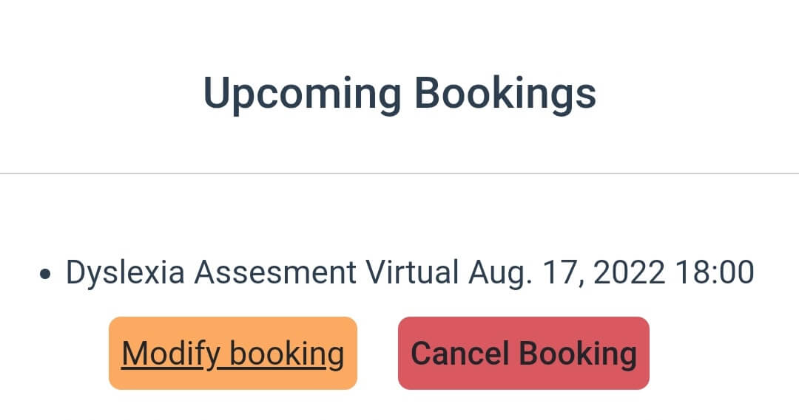
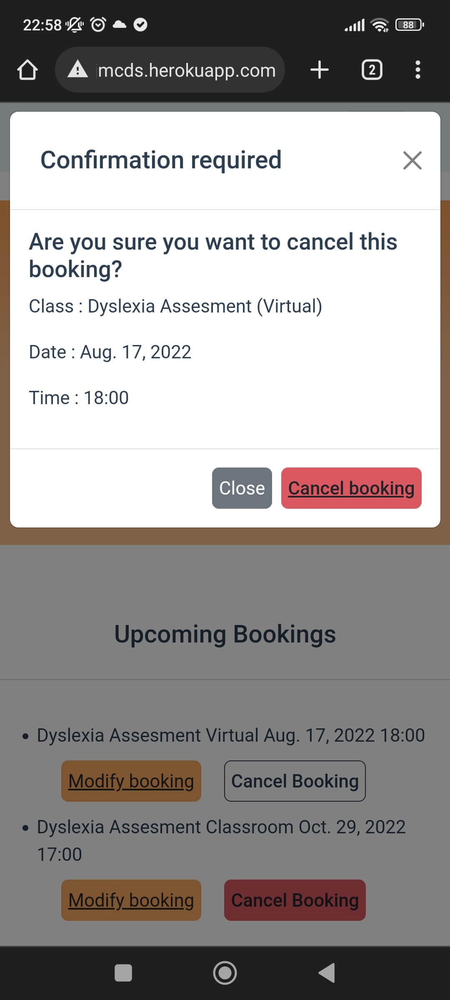

# Code Validation

## [W3C Markup Validation Service](https://validator.w3.org/)

HTML Validation

Page                      | Image
--------------------      | ---------------
index.html                | 
services.html             | 
client-details-form.html  | 
view-bookings.html        | 
make-booking.html         | 
edit-booking.html         | 

## [W3C CSS Validation Service](https://jigsaw.w3.org/css-validator/)

## [JSHint Validator](https://jshint.com/)

## [PEP8 Python Validation](http://pep8online.com/)

Home App

Python Files  | PEP8 result
------------- | -------------
admin.py      | 
models.py     | 
views.py      | 
forms.py      | 

Booking App

Python Files  | PEP8 result
------------- | -------------
admin.py      | 
views.py      | 
forms.py      | 
models.py     | 

## Lighthouse results:
- Desktop:

- Mobile:

# User Story Testing: 

## 1. As a site owner I can advertise my services so that potential clients can learn about my business
- The site owner has a site displaying with all services apparent on the home page.
- Users can get deeper information about the srvices provided by navigating to the Services page through the nav bar.
- All links have been tested and the Services link correctly navigate to the applicable section of that page.
## 2. As a site owner I can receive contact from users so that I can respond to any queries or requests
- The contact information for the site owner is displayed on every page in the footer.
- For registered users, upon making a booking, a modal displays advising contact information for clients to organise payment. This can be seen in features section of (README.md)[README.md]
- Both registered and unregistered users can contact the site owner through the contact form on the home page.
- This is done through (EmailJS)[emailjs.com]. Testing was completed to ensure messages would send correctly with the specified variables first on the emailJS site. A result of 200 and email received provided confirmation of this.

- Testing of the API was further carried out following implementation to ensure emails were received to the site email and auto replies were sent. Evidence of thi can be seen in features section of (README.md)[README.md] 
## 3. As a site owner I can access client bookings so that I can modify or delete if necessary
- The site owner has full CRUD functionality with regards client bookings in the admin site.
- In the admin site, booking section, the site owner can view, filter and access any booking put through the site.

- In the admin site, the site owner can choose a booking and make a change or delete it. This was tested manually by making changes to and deleting existing bookings. The booking either disappears from the list of bookings or the details change successfully. 
- The admin site provides feedback of success for both.

 

## 4. As a site owner I can accept, cancel and modify bookings so that I can manage my calendar efficiently
- In the admin site, the site owner has the ability to change the STATUS of a booking. This is built into the Booking model.
- New booking are not confimred for registered users until the STATUS is updated by the site owner. A manual test for this is shown below with a pending booking.

  

- Once the STATUS of the booking is updated to accepted by the site owner, only then is it confirmed to the client.
 

- The site owner does not have to worry about double bookings either due to the unique constraint on the bookind_date and time_slot. This was tested manually on the user site and the admin site. Feedback is provided to the admin and custom feedback is provided to registered users who try book a slot already taken through the booking forms. This was tested successfuly for both 'make booking' and 'edit booking' functionality.

 
  
##  5. As a site user I can register an account so that I provide my information & book classes
- New users can register an account with the site through the registeration page by providing their email, first name, last name and a password.
- Unregistered users are taken to this page by clicking the register link in the nav-bar or "book a screening" call to action button on the home page.

- Once users are registered, they can provide their information through  the client details form, to which they are redirected upon registration or at a later later when prompted on the home page.
- This feeds through to the Client model and is displayed to the site owner throught the admin site.

- Users can book classes once registered as the booking links become available once they register or log in. Manual testing was carried out through development and evidence of this can be seen in nav bar section of the features in (README.md)[README.md]

##  6. As a site user I can easily navigate the site so that I can find all the necessary information and features without difficulty
- Unregistred users can navigate to any non-restricted section of the site through the nav-bar. This is present on every page and so every page is accessed easily from any other page on the site.
- The same can be said for resgistered users with the exception of the edit booking form which cannot be accessed through the nav-bar. It is accessed through the 'View Bookings' page.
  
##  7. As a registered user I can access my bookings so that I can modify them and delete them if necessary
- Registered users can access their bookings through the 'View Bookings' page.
- Users can modify bookings and cancel bookings here. The modify booking buttons brings users to the 'Edit Booking' page where they can edit their booking. This can be seen in the features in (README.md)[README.md].
- The cancel button will delete the booking. Defensive prgramming has been employed here and a pop up will ask users to confirm they are sure they wish to delete a booking before they do so.
- Manual testing of this can be seen below, as the booking no longer appears in users upcoming bookings. This also deletes it from the admin site, this has been tested

 

##  8. As a registered user I can view my previous bookings so that I can see the history of classes I have taken  
- In the view bookings site, users can see their history of bookings once it the STATUS has been marked as completed. The past bookings can be seen in the features in (README.md)[README.md].
- Manual testing was conducted to ensure that 'Completed' bookings showed up in the correct sections. Evidence of a manual test can be seen below;

 

# Other manual testing

### Booking forms
- There are some mechanisms within the booking forms to prevent faulty bookings from entering the system. 
- As seen in the user stories above, the booking forms will not allow double bookings and a message will be diplayed to the user if they attempt this. This is confgured in views.py.
- Similarly, bookings must be made 1 day in advance to prevent bookings with dates in the past being made. A similar message will display for the user if they try submit a past date through the form. This was tested by submitting a date in the past into the form.

 

- The booking forms will also not accept empty or invalid dates. If these are entered, the booking form will not save and a message will display in a modal advising the user to select a date. They cannot dismiss this modal without clicking the 'OK' button.
- This is handled with the following custom javascript. The full functions wihtin the eventListener can be seen in script.js.

``if (bookingSubmit != null) {
    bookingSubmit.addEventListener("click", () => {
        emptyDateModal();
        onEmptyDateModalClose();
    });
}``

- This was tested by submitting invalid data into both forms and ensuring the form did not submit. Evidence below:

 

- It was then confirmed after in the admin site that no bookngs with invalid data were present.

### Client details form
- Another piece of custom javascript which was  manually tested is in the childs_name field of the client details form.
- If a user is not submitting details for a child, it will not allow them submit a child's name.
- It does not by disabling the field if the is_guardian checkbox is ticked.
- This was manually tested by toggling the check box.

 

### Anchor tags
- All anchor tags which link to external sites were manually tested to ensure they open in a new tab.
- All anchor tags which link to a section on the site were manually tested to ensure they linked to the correct section.

